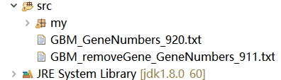
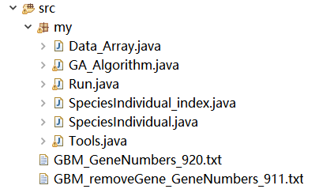

# CGA-MWS-algorithm

# `JAVA` source code of CGA-MWS algorithm 

## A brief description of algorithm

* INPUT: a weighted non-binary mutation matrix `A`, a parameter `K`;
* OUTPUT: a submatrix `M`.

## Example of `txt` file input to algorithm

| Gene | TP53 | CDKN2A | CDKN2B| RB1 | CDK4| … |
| :--: | :--: | :--: | :--: | :--: | :--: | :--: |
| Sample_1 | 1 | 1.5 | 0 | 0 | 1 | … |
| Sample_2 | 0.45 | 1 | 0 | 0.4 | 1.5 | … |
| Sample_3 | 0 | 1.5 | 0 | 0.3 | 0 | … |
| … | … | … | … | … | … | … |

## The process of executing the project

1. You need to import the downloaded `my` folder and sample files into `eclipse` or `MyEclipse` and execute them in the `JAVA8` environment whenever it is possible. Files are stored as follows: 

   
   
   
2. The `main` method in `Run.java` is the entry to the whole program.
  
3. Enter the relative or absolute path of the `txt` file in the following statement.

       String path = "GBM_removeGene_GeneNumbers_911.txt;";
   
4. Setting parameters.
   * This project provides two real data of `GBM`, `GBM_ GeneNumbers_ 920.txt` is a file that does not remove the genes. And `GBM_ removeGene_ GeneNumbers_ 911.txt` is a file that deleted the genes mentioned in the paper. The parameter `g` is given in the file name.
   * If the input sample file `GBM_removeGene_GeneNumbers_911.txt` is used, the parameter `k` is modified and other parameters remain the default in the `r.run()` statement.
   * Modify the parameters on the code shown below:
   
         int g = 911;
         int k = 6;
         r.run(paths, g, k, g / 2, 1000, 0.3, 1, 1000, "calfitness_Cov");
 
     * The first   parameter:  The path of `txt` file，
     * The second  parameter:  Number of genes in `txt` file，
     * The third   parameter:  The size of Gene set (k)，
     * The fourth  parameter:  Population size (N, this value is the size of all populations combined)，
     * The fifth   parameter:  Iteration steps (maxg)，
     * The sixth   parameter:  Mutation probability (Pm)，
     * The seventh parameter:  Number of times the algorithm is executed，
     * The eighth  parameter:  Number of cycles when calculating p-value,
     * The ninth   parameter:  Model name ("calfitness_Cov"),

5. After setting the parameters, CGA-MWS algorithm can be executed.

## Some supplementary notes

* If you input other custom files, please check the file format and adjust the parameters.
* The printout of CGA-MWS algorithm after successful execution is as follows:

      NO.1  Execute the algorithm to reconstruct the initial population
      total time：0.6491s

      NO.1 time, The optimal gene set is：{ PTEN, EGFR, PIK3R1, PIK3CA, COL1A2, PDGFRA, }
      Fitness: 209.6769
      CO(M): 70.5
      ME(M): 139.1769

      1 times, the average execution time is：0.6491s
      p-value is: 1.0

