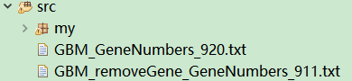
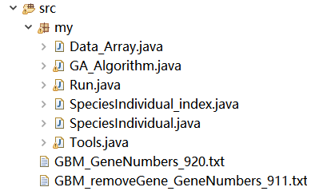

# CGA-MWS-algorithm

# CGA-MWS algorithm JAVA source code

## A brief description of algorithm

* INPUT: a weighted non-binary mutation matrix `A`, a parameter `K`;
* OUTPUT: a submatrix `M`.

## Format of TXT file for input algorithm

| Gene | TP53 | CDKN2A | CDKN2B| RB1 | CDK4| … |
| :--: | :--: | :--: | :--: | :--: | :--: | :--: |
| Sample_1 | 1 | 1.5 | 0 | 0 | 1 | … |
| Sample_2 | 0.45 | 1 | 0 | 0.4 | 1.5 | … |
| Sample_3 | 0 | 1.5 | 0 | 0.3 | 0 | … |
| … | … | … | … | … | … | … |

## Preparations before starting the program

1. You need to import the downloaded `my` folder and sample files into `eclipse` or `MyEclipse` with `JAVA8` for execution. As shown in the figure below:</br>

   
   
   
2. The `main` method in `Run.java` is the entry to the whole program.
   ```Java
   Run r = new Run();
   String path = "GBM_removeGene_GeneNumbers_911.txt;";
   String[] paths = path.split(";");
   
   int g = 911;
   int k = 6;
   int size = g / 2;
   r.run(paths, g, k, size, 1000, 0.3, 1, 1000, "calfitness_Cov");
   ```

3. Enter the path to the TXT file at this location, relative or absolute path.
   ```Java
   String path = "GBM_removeGene_GeneNumbers_911.txt;";
   ```
   
4. Parameter setting.

   Input parameters in this method, just modify the parameters `g` and `K`.
   The parameter `g` at the bottom is the number of genes in the `GBM_removeGene_GeneNumbers_911.txt` file. It is not necessary to modify it.
   ```Java
   int g = 911;
   int k = 6;
   int size = g / 2;
   r.run(paths, g, k, size, 1000, 0.3, 1, 1000, "calfitness_Cov");
   ``` 
   * The first   parameter:  The path of TXT file，
   * The second  parameter:  Number of genes in TXT file，
   * The third   parameter:  The size of Gene set (k)，
   * The fourth  parameter:  Population size (N, this value is the size of all populations combined)，
   * The fifth   parameter:  Iteration steps (maxg)，
   * The sixth   parameter:  Mutation probability (Pm)，
   * The seventh parameter:  Number of times the algorithm is executed，
   * The eighth  parameter:  Number of cycles when calculating p-value,
   * The ninth   parameter:  Model name ("calfitness_Cov"),

5. After setting the parameters, CGA-MWS algorithm can be executed.

## Some supplementary notes

* This project provides two real data of GBM in this paper, `GBM_ GeneNumbers_ 920.txt` is a file that does not remove the genes expressed in the paper.
* `GBM_ removeGene_ GeneNumbers_ 911.txt` is a file that removes the genes expressed in the paper.
* To adjust the input sample file, note that the parameter `g` and parameter `k` are modified, and the parameter g is given in the file name.
* If you input other custom files, please check the file format and adjust the parameters.
* The printout of CGA-MWS algorithm after successful execution is as follows:

      NO.1  Execute the algorithm to reconstruct the initial population
      total time：0.6491s

      NO.1 time, The optimal gene set is：{ PTEN, EGFR, PIK3R1, PIK3CA, COL1A2, PDGFRA, }
      Fitness: 209.6769
      CO(M): 70.5
      ME(M): 139.1769

      1 times, the average execution time is：0.6491s
      p-value is: 1.0

